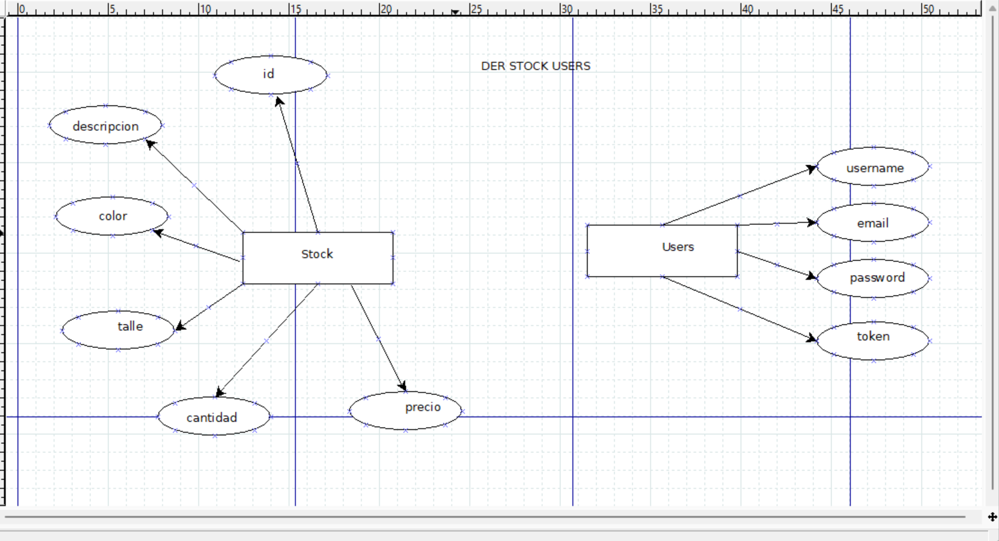

<h1 align="center"> APLICACION DE CONTROL DE STOCK </h1>

 Permite realizar un CRUD de usuarios y stock de indumentaria de un local de ropa. 
 Al interactuar con la API se realizan las acciones detalladas más abajo, algunas de las cuales necesitan autorización especial. Para controlar el acceso a los recursos privados se utiliza el sistema de autenticación por tokens.
 
#### En ésta aplicación se podrán realizar las siguientes acciones:

Es necesario que el usuario esté logueado para realizar todas las acciones, salvo las marcadas con (*)

### USUARIOS

- Obtener todos los usuarios sin mostrar datos sensibles (*)
- Registrar un nuevo usuario (*)
- Login y autenticación por token tipo SHA512 (*)
- Modificar datos de un usuario
- Eliminar un usuario
- Logout

### STOCK

- Obtener todos las instancias del stock (*)
- Crear una instancia de stock
- Actualizar una instancia de stock
- Eliminar una instancia de stock

La estructura de la aplicación es la siguiente:

- STOCK-TP-FINAL

  - src/
    - controllers
      - user-controller.ts
      - chart-controller.ts
    - database
      - users.json
      - charts.json
    - models
      - user-model.ts
      - chart-model.ts
    - routes
      - chart-router.ts
      - user-router.ts
    - index.ts
    - .gitignore
    - package.json
    - tsconfig.json
    - README.md

### ERD ###

#### INDEX.TS

Es el encargado de inicializar la APP de Express y configurar lo básico necesario.

#### MIDDLEWARES

Autenticacion de usuarios entre la solicitud del cliente y la respuesta del servidor.

#### /ROUTES

Es el directorio que contiene los routers relativos a cada base de datos. Cada módulo router contiene dentro una instancia del Router de Express con todas los endpoints relativos a cada entidad.

#### /CONTROLLERS

Tiene los controladores de user y stock. Son los encargados de manejar las Request/Response, de interactuar con los modelos, y de realizar chequeos: si el dato necesario está en la request y si ese dato tiene el formato correcto.

#### /MODELS

Contiene los modelos de user y stock. Cada uno tiene por objetivo ejecutar todas las acciones para poder interactuar con las bases de datos. Realiza tambien los chequeos relativos a si un usuario o instancia de stock ya existe en la base de datos.

#### / DATABASES

#### stock.json

    Es una collection cuyos objetos tienen el siguiente formato:
        [
            {
                "id": "12345-123123-123123-123123-12312",
                "descripcion": "Calza",
                "color": "negro",
                "talle": "S",
                "cantidad": 50,
                "precio": 29.99
            }
        ]

#### users.json

    Es una collection cuyos objetos tienen el siguiente formato:

        [
            {
                "username": "Josefina",
                "email": "jrodriguez@gmail.com",
                "password": "12312312",
                "token": "0c8ee8f9-6be8-49f7-988a-3161dbd47b06"
            }
        ]

##  Instalación de dependencias:

    - ts-node
    - ts-node-dev
    - typescript
    - express
    - jsonfile
    - zod
    - dotenv

    Correr el porgrama con:

    - npm run dev en desarrollo
    - npm start en producción

## ENDPOINTS

- **GET |** 127.0.0.1/api --> Obtener info general útil de la APP. (agregarlo)

- **GET |** 127.0.0.1/api/users --> Obtener todos los usuarios registrados.
- **GET |** 127.0.0.1/api/users/:id --> Obtener un usuario por su id.

- **GET |** 127.0.0.1/api/stock --> Obtener toda el stock.
- **GET |** 127.0.0.1/api/stock/:descripcion --> Obtener un registro de stock por descripcion.

- **POST |** 127.0.0.1/api/users --> Dar de alta nuevo usuario.
- **POST |** 127.0.0.1/api/stock --> Crear nueva registro de stock.

- **PATCH |** 127.0.0.1/api/users/:id --> Actualizar un usuario.
- **PATCH |** 127.0.0.1/api/stock/:id --> Actualizar un registro de stock.

- **DELETE |** 127.0.0.1/api/users/:id --> Eliminar un usuario.
- **DELETE |** 127.0.0.1/api/stock/:id --> Eliminar un resgistro de stock.

ENDPOINTS.

Usuarios (userRouter)

GET    | 127.0.0.1/api/ - Recupera una lista de todos los usuarios registrados.

POST   | 127.0.0.1/api/users/login - Iniciar sesión y crea un token de autenticación.
POST   | 127.0.0.1/api/users - Dar de alta nuevo usuario.

PATCH  | 127.0.0.1/api/users/:username - Actualiza la información de un usuario. > "autenticación"

DELETE | 127.0.0.1/api/users/logout - Cierra sesión y elimina el token de autenticación.
DELETE | 127.0.0.1/api/users/:username - Elimina un usuario. > "autenticación"

Stock (stockRouter)

GET    | 127.0.0.1/api/ - Recupera información sobre el stock disponible.
GET    | 127.0.0.1/api/stocks - Recupera una lista de todos los productos en el stock.
GET    | 127.0.0.1/api/stocks/:name - Busca productos por nombre en el stock.

POST   | 127.0.0.1/api//stocks - Agrega un nuevo producto al stock

PATCH  | 127.0.0.1/api/stocks/:name - Actualiza un producto en el stock.

DELETE | 127.0.0.1/api/stocks/:name - Elimina un producto del stock.

Algunos endpoints requerirán autenticación y serán especificados con "autenticación" junto a su descripción.

